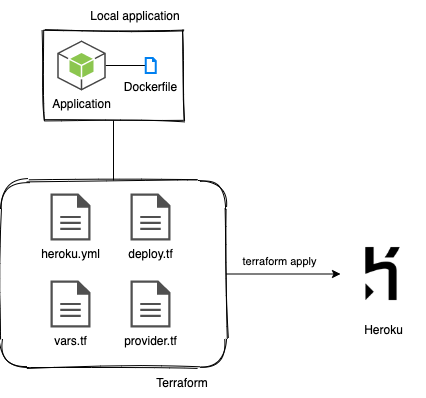

# Terraform - Heroku automation

##### Terraform - What is it ?
In very simples terms, Terraform allow us to easily deploy our applications to the cloud using a toolchain provided by them.
To understand more about Terraform and its structure, [read more](https://www.terraform.io/docs/modules/index.html).

## Repository
This repository shows an example of automating a very simple node.js project in Heroku using Terraform. This Node.JS project could easily be replaced by any other language.

## Architecture



##### Description

First, I developed a simple Node.JS project and created a Dockerfile to run this application in our Docker platform.
After the project is implemented, I wanted to deploy to a Heroku dyno using Terraform and for that, I purpose I created the following file structure:
* **provider .tf** - Initializes the Heroku provider in Terraform.
* **deploy .tf** - Responsible to create the application and to deploy the docker image to the cloud.
* **vars .tf** - Holds the variables used in my Terraform structure. Note that you need to create the terraform.tfvars in order to use this repository since this file will hold important variable values.
* **heroku .yml** - Sets up Heroku build strategy to deployment.

##### Dependencies

* Terraform
* Docker
* terraform.tfvars with Heroku API variable filled.

Clone this repository into your local PC and run

```node
terraform plan
```
...to see the changes that will be applied.
```node
terraform apply
```
...to apply these changes.

## Contributing
Pull requests are welcome. For major changes, please open an issue first to discuss what you would like to change.

## License
[MIT](https://choosealicense.com/licenses/mit/)